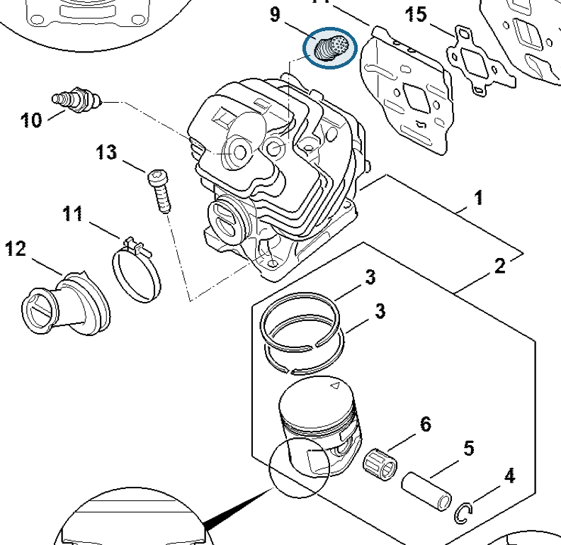

# Decompression valve

**1142 020 9400**

Bin **A5** · **1** per kit · **S2** supervision

[Part page](https://rduncangt.github.io/frk-management/parts/11420209400/) · [Field card PDF](field-card.pdf?raw=1) · [Avery label PDF](bag-label.pdf?raw=1) · [Offline reference](../../frk-part-reference.pdf?raw=1)

## MS 462 — cylinder

Decompression valve in the cylinder. Also listed in section D, drawing p. 11 / table p. 12.

**Item 9 · Qty listed: 1**

MS 462 C-M Z spare-parts list, 10/29/2024. Drawing p. 9; parts table p. 10.

Drawings © ANDREAS STIHL AG & Co. KG. Not to scale.
