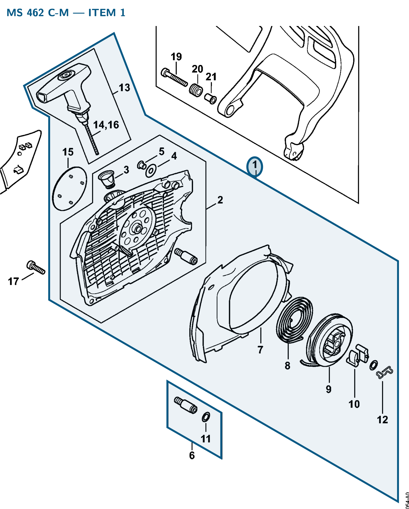

# Fan housing with rewind starter

**1142 080 2102**

Bin O2 · 1 spare per FRK · S2 supervision

[Field card (PDF)](field-card.pdf?raw=1) · [Part label (PDF)](bag-label.pdf?raw=1)

| Saw | Application | Qty fitted | Item |
| :--- | :--- | :---: | :---: |
| MS 462 C-M | Crankcase | 1 | 1 |

## MS 462 — rewind starter

Includes items 2–15. Mounts to the crankcase with three pan head screws **[9022 371 1020](../90223711020/README.md#ms-462--starter--fan-housing)** (IS M5×20; item 17).

**Item 1 · Qty fitted: 1**

Source: STIHL MS 462 C-M Z spare-parts list, edition 10/29/2024, section O; drawing on PDF page 21, parts table on page 22.

Drawing © ANDREAS STIHL AG & Co. KG. Not to scale.
