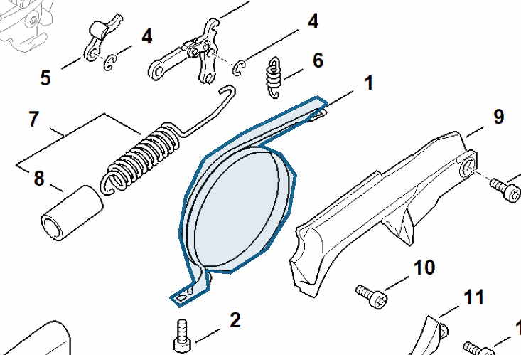

# Brake band

**1142 160 5400**

Bin **O2** · **1** per kit · **S2** supervision

[Part page](https://rduncangt.github.io/frk-management/parts/11421605400/) · [Field card PDF](field-card.pdf?raw=1) · [Avery label PDF](bag-label.pdf?raw=1) · [Offline reference](../../frk-part-reference.pdf?raw=1)

## MS 462 — chain brake

Brake band around the clutch drum. Shown with tension spring [1142 160 5500](../11421605500/README.md).

**Item 1 · Qty listed: 1**

MS 462 C-M Z spare-parts list, 10/29/2024. Drawing p. 15; parts table p. 16.

Drawings © ANDREAS STIHL AG & Co. KG. Not to scale.
