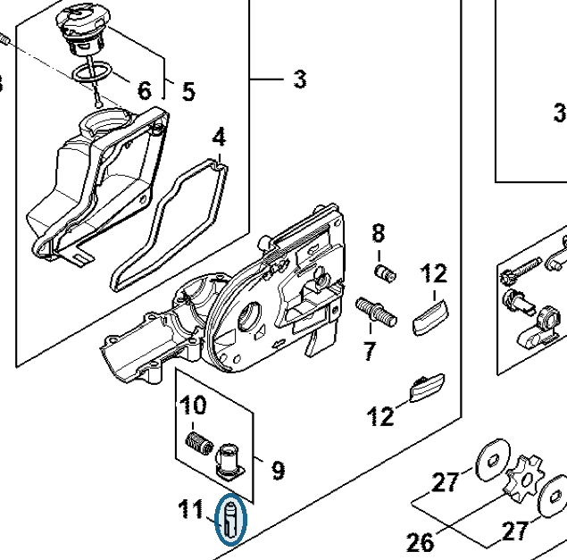

# Oil pump

**4138 640 3200**

Bin **D3** · **1** per kit · **S2** supervision

[Part page](https://rduncangt.github.io/frk-management/parts/41386403200/) · [Field card PDF](field-card.pdf?raw=1) · [Avery label PDF](bag-label.pdf?raw=1) · [Offline reference](../../frk-part-reference.pdf?raw=1)

## HT 135 — oil pump

Oil pump in the gear-head housing.

**Item 11 · Qty listed: 1**

HT 135-Z spare-parts list, 10/28/2024. Drawing p. 17; parts table p. 18.

Drawings © ANDREAS STIHL AG & Co. KG. Not to scale.
