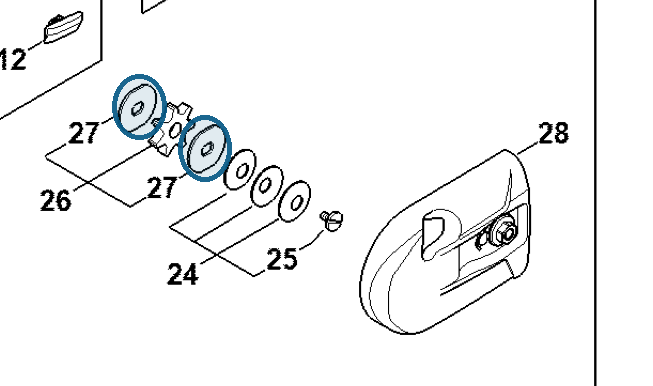

# Washer

**4182 162 8900**

Bin **A3** · **2** per kit · **S2** supervision

[Part page](https://rduncangt.github.io/frk-management/parts/41821628900/) · [Field card PDF](field-card.pdf?raw=1) · [Avery label PDF](bag-label.pdf?raw=1) · [Offline reference](../../frk-part-reference.pdf?raw=1)

## HT 135 — gear head

Washers on either side of chain sprocket [0000 640 2003](../00006402003/README.md) (item 26).

**Item 27 · Qty listed: 2**

HT 135-Z spare-parts list, 10/28/2024. Drawing p. 17; parts table p. 18.

Drawings © ANDREAS STIHL AG & Co. KG. Not to scale.
