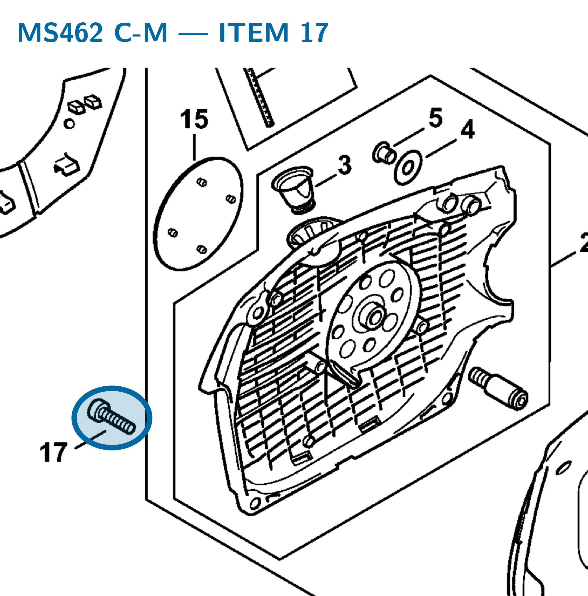
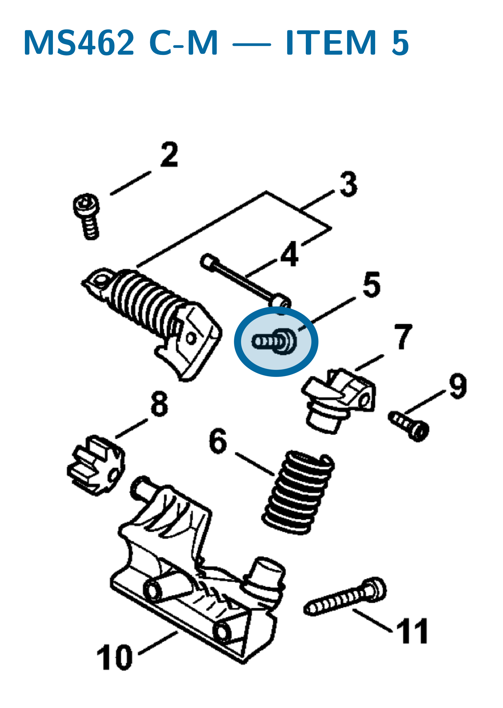
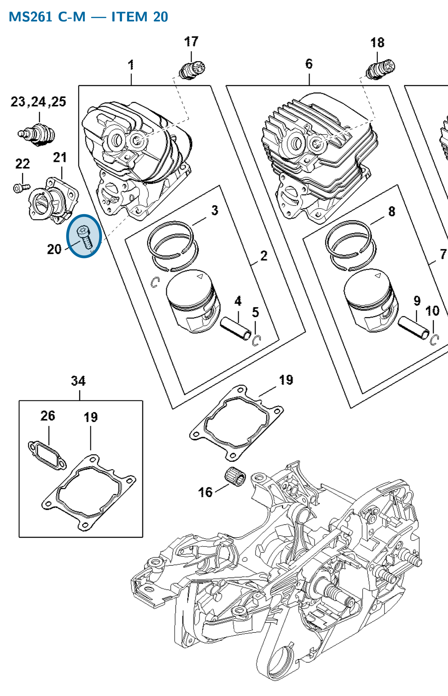

# Pan head screw IS M5×20

**9022 371 1020**

Bin A9 · 1 spare per FRK · S2 supervision · 2″ × 3″ bag

[Field card (PDF)](field-card.pdf) · [Bag label (PDF)](bag-label.pdf)

| Saw | Application | Qty fitted | Item |
| :--- | :--- | :---: | :---: |
| MS 462 C-M | Starter / fan housing to crankcase | 3 | 17 |
| MS 462 C-M | Anti-vibration (AV) spring attachment | 1 | 5 |
| MS 261 C-M | Cylinder to crankcase | 4 | 20 |

## MS 462 — starter / fan housing

Secures the starter / fan housing to the crankcase. Listed separately from the complete starter assembly.

**Item 17 · Qty fitted: 3**

Source: STIHL MS 462 C-M Z spare-parts list, edition 10/29/2024, section O; drawing on PDF page 21, parts table on page 22.

## MS 462 — AV system

Anti-vibration spring attachment.

**Item 5 · Qty fitted: 1**

Source: STIHL MS 462 C-M Z spare-parts list, edition 10/29/2024, section AI; drawing on PDF page 32, parts table on page 33.

## MS 261 — cylinder

Secures the cylinder to the crankcase.

**Item 20 · Qty fitted: 4**

Source: STIHL MS 261 C-M spare-parts list, edition 10/02/2023; drawing on PDF page 8, parts table on page 9.

Drawings © ANDREAS STIHL AG & Co. KG. Not to scale.
