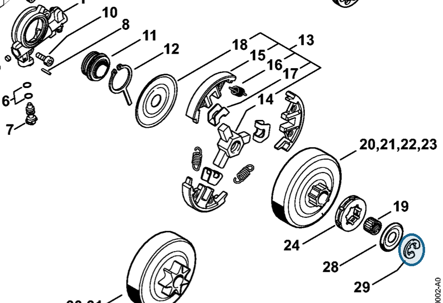
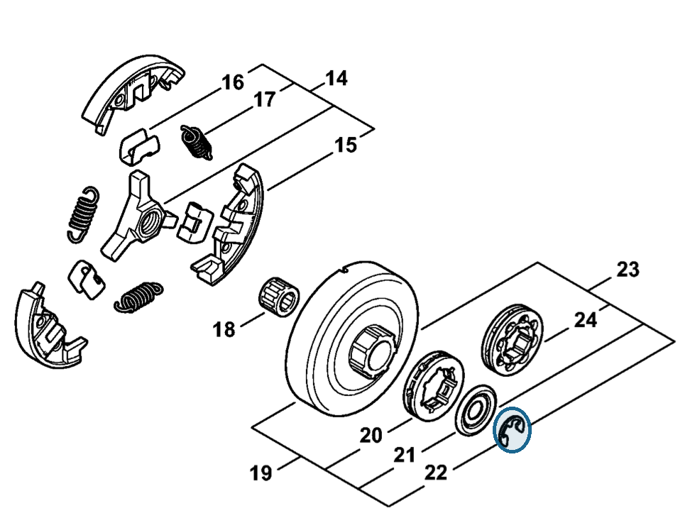

# E-clip 8x1.3

**9460 624 0801**

Bin **A4** · **12** per kit · **AS1** supervision

[Part page](https://rduncangt.github.io/frk-management/parts/94606240801/) · [Field card PDF](field-card.pdf?raw=1) · [Avery label PDF](bag-label.pdf?raw=1) · [Offline reference](../../frk-part-reference.pdf?raw=1)

## MS 261 — clutch drum

Retains washer [0000 958 1022](../00009581022/README.md). Included in rim sprocket kit [1141 007 1002](../11410071002/README.md).

**Item 29 · Qty listed: 1**

MS 261 C-M spare-parts list, 10/02/2023. Drawing p. 10; parts table p. 12.

## MS 462 — clutch drum

Retains washer [0000 958 1032](../00009581032/README.md). Included in rim sprocket kit [1128 007 1001](../11280071001/README.md).

**Item 22 · Qty listed: 1**

MS 462 C-M Z spare-parts list, 10/29/2024. Drawing p. 13; parts table p. 14.

Drawings © ANDREAS STIHL AG & Co. KG. Not to scale.
